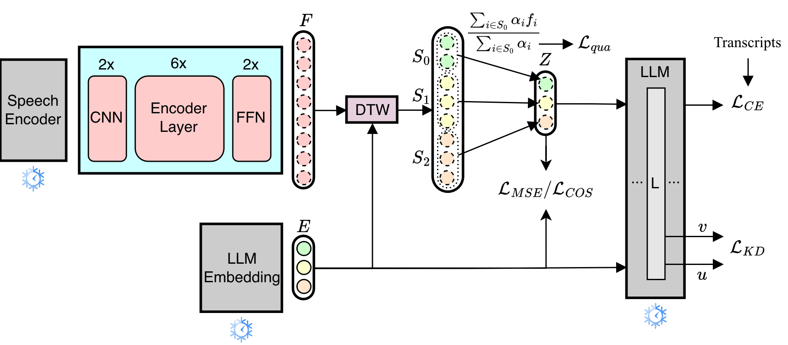

# Align, Integrate, and Fire: Efficient Token-Level Alignment for Zero-Shot SpeechLLMs

Code for reproducing Aligned Continuous Integrate-and-Fire (ACIF), our method for training SpeechLLMs using only ASR data. The paper was accepted at WMT2026. 



## Setup
```bash
conda create -n acif python=3.12.13
conda activate acif
pip install -r requirements.txt
```

## Training

First we precompute the speech embeddings:

```bash
python precompute_embeddings.py --output_dir data/seamless
```

Stage 1 training phase:
```bash
python acif/train.py \
    --model_name "meta-llama/Llama-3.1-8B-Instruct" \
    --embeddings_dir data/seamless \
    --lr 1e-4 \
    --weight_mse 0.01 \
    --weight_cos 10.0 \
    --weight_qua 1.0 \
    --max_steps 250000
```

Stage 2 fine-tuning phase with KL loss using 1 model layer:
```bash
python acif/train.py \
    --model_name "meta-llama/Llama-3.1-8B-Instruct" \
    --pretrained_ckpt "checkpoints/stage1_checkpoint.ckpt" \
    --embeddings_dir data/seamless \
    --lr 1e-5 \
    --weight_mse 0.01 \
    --weight_cos 10.0 \
    --weight_qua 1.0 \
    --weight_kd 1.0 \
    --kd_layers 1 \
    --kd_loss_type "kl" \
    --max_tokens_per_batch 1024 \
    --max_steps 20000
```


## Evaluation
First download and extract [Europarl-ST](https://www.mllp.upv.es/europarl-st/v1.1.tar.gz) and [CoVoST2](https://mozilladatacollective.com/) data.

Second convert audio files into wav files and compress them:
```bash
python evaluation/convert_to_wav.py --input data/covost_v2-en_de/clips --output data/covost_v2-en_de/clips_wav
zip -r -0 data/covost_v2-en_de/clips_wav.zip data/covost_v2-en_de/clips_wav

python evaluation/convert_to_wav.py --input data/v1.1/en/audios --output data/v1.1/en/audios_wav
zip -r -0 data/v1.1/en/audios_wav.zip data/v1.1/en/audios_wav
```

Evaluation of ASR on Librispeech test-clean:
```bash
python evaluation/evaluate_asr.py \
    --method acif \
    --dataset librispeech \
    --split test_clean \
    --model_name "meta-llama/Llama-3.1-8B-Instruct" \
    --ckpt_path "checkpoints/stage2_checkpoint.ckpt" \
    --batch_size 16 \
    --num_beams 1

```

Evaluation of ST performance on Europarl-ST English-German:
```bash
python evaluation/evaluate_st.py \
    --dataset europarl_st \
    --tgt_lang de \
    --split test \
    --model_name "meta-llama/Llama-3.1-8B-Instruct" \
    --ckpt_path "checkpoints/stage2_checkpoint.ckpt" \
    --batch_size 16 \
    --num_beams 1
```

## Analysis
The code for reporoducing the analysis in Figure 3 Section 6.1. The code generates the figure:
```bash
python analysis/embed.py --output_dir data/llm_embeddings
python analysis/eigen.py --input_dir data/llm_embeddings
```